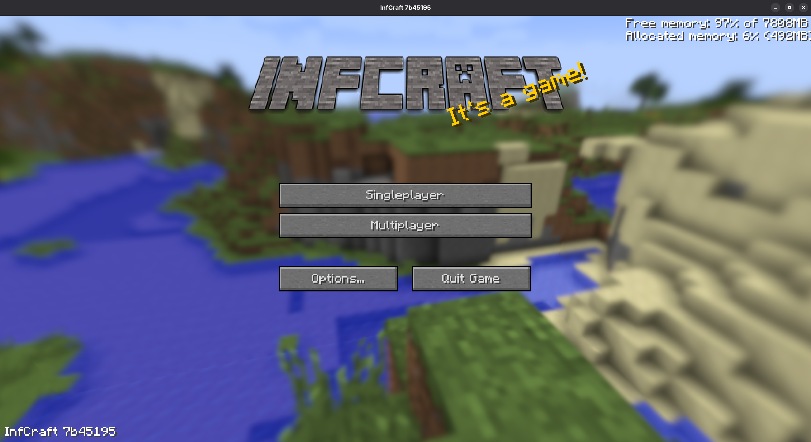

[![Contributors][contributors-shield]][contributors-url]
[![Forks][forks-shield]][forks-url]
[![Stargazers][stars-shield]][stars-url]
[![Issues][issues-shield]][issues-url]
[![MPL License][license-shield]][license-url]

  

  

  <h3 align="center">InfCraft</h3>

  

    InfDev, but different.
      
    <a href="https://github.com/Nicolas-Industries/infcraft/wiki">
      <b>Explore the docs »</b>
    </a>
     
    <a href="https://github.com/Nicolas-Industries/infcraft/issues/new?assignees=&labels=&projects=&template=bug_report.md&title=">
      Report Bugs
    </a>
    ·
    <a href="#-downloading">
      Download
    </a>
    ·
    <a href="https://github.com/Nicolas-Industries/infcraft/issues/new?assignees=&labels=&projects=&template=feature_request.md&title=">
      Feature Request
    </a>
  

 

> [!WARNING]
> This project **IS NOT** affiliated with Mojang or other minecraft product.  
> This is just a hobby and I do not take care of any uses provided to this utility.

 

## ✅ Getting started
**InfCraft** is a game programmed in Java, it runs on the same engine as Minecraft (LWJGL 3 + Java 21).

### Why this project? 🤔
I created this project because Minecraft, because I haven't seen any good Minecraft InfDev forks out there,
this one does that most of them don't!
Such as our multiplayer implementation.

---

  

    <h3>Screenshots</h3>
  
 
  

    &nbsp;
    
  

---

## ☕ Downloading
We already have prebuilt jars. They can be downloaded [here](https://github.com/Nicolas-Industries/infcraft/actions).

---

## ⚖️ License

**You can:**
- Make modifications of this project. *(includes modifying texture, resources, classes,...)*
- Redistribute that modifications. *(without impersonating anyone)*
- Give yourself part of the credits. *(but giving most of the credits to the original authors)*
- Obfuscate **some parts** of the code to promote security. *(authentication purposes,...)*

---

**You must not:**
- Sell the game or its modifications.
- Change the license document.
- Put malware in the code of this repository or any forks of it.
- Impersonate authors of the project.

---

**You must:**
- Give credits to the original authors of this project.

---

**The full license is at [BSL 1.0][license-url].**

---

[contributors-shield]: https://img.shields.io/github/contributors/InfCraft-Studios/InfCraft.svg?style=for-the-badge
[contributors-url]: https://github.com/Nicolas-Industries/infcraft/graphs/contributors
[forks-shield]: https://img.shields.io/github/forks/InfCraft-Studios/InfCraft.svg?style=for-the-badge
[forks-url]: https://github.com/Nicolas-Industries/infcraft/network/members
[stars-shield]: https://img.shields.io/github/stars/InfCraft-Studios/InfCraft.svg?style=for-the-badge
[stars-url]: https://github.com/Nicolas-Industries/infcraft/stargazers
[issues-shield]: https://img.shields.io/github/issues/Nicolas-Industries/infcraft.svg?style=for-the-badge
[issues-url]: https://github.com/Nicolas-Industries/infcraft/issues
[license-shield]: https://img.shields.io/github/license/Nicolas-Industries/infcraft.svg?style=for-the-badge
[license-url]: https://github.com/Nicolas-Industries/infcraft/blob/main/LICENSE.txt
